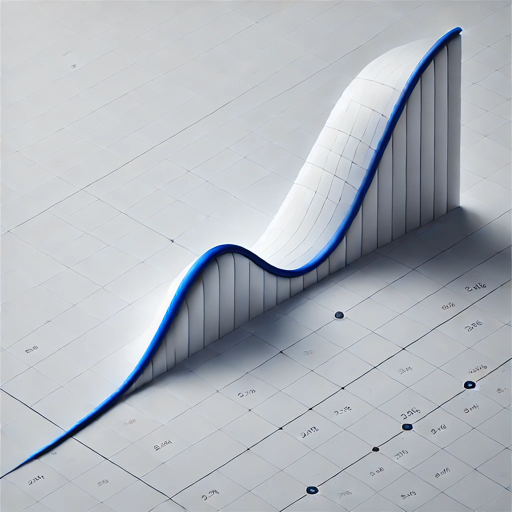

  

# Main Sequence Instrument DAshboards — Pricing building blocks & examples (Python / QuantLib)

This repository is a growing collection of dashboards for different use cases in the main sequence platform. 

